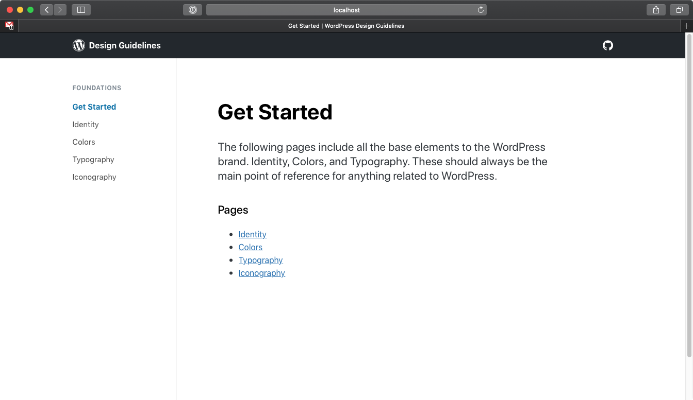

# WordPress Design Guidelines

> Documentation, tools, and resources for designing WordPress.

## Prerequisites

-   [NodeJS](https://nodejs.org/en/)
-   [Yarn](https://yarnpkg.com/lang/en/) (or [npm](https://www.npmjs.com/get-npm))

This project is powered by JavaScript, and it uses [Yarn](https://yarnpkg.com/lang/en/) as it's dependency manager. It is recommended that you [install Yarn](https://yarnpkg.com/en/docs/install) before starting.

Alternatively, you can use [npm](https://www.npmjs.com/get-npm).

## Getting Started

### Cloning the repo

First, you'll need to clone the repo onto your computer. Below is a handy resource from Github on how that can be done:

👉 [Github: Cloning a Repo](https://help.github.com/en/articles/cloning-a-repository)

### Installing dependencies

Once you've cloned the repo to your computer. Open up your Terminal app, and navigate to that directory.

To install dependencies, run the following command:

```
yarn install
```

If you're using npm, run:

```
npm install
```

It might take a bit. Maybe 30-60 seconds or so.

### Starting up local development

Alrighty! You're ready to fire up local development! To do this, run the following command:

```
yarn start
```

If you're using npm, run:

```
npm start
```

This project uses [Gatsby](https://www.gatsbyjs.org/) to build the site. Once Gatsby does it's thing, it'll automatically open up the local development version of the site with your default browser.

The local development URL should look something like this:

[http://localhost:5800](http://localhost:5800)



And with that, you're ready to start exploring, designing, and developing! 🙌

Have fun!
